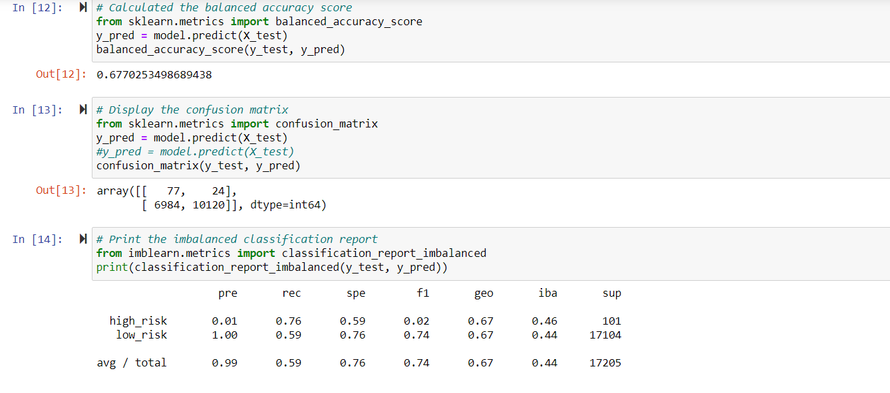
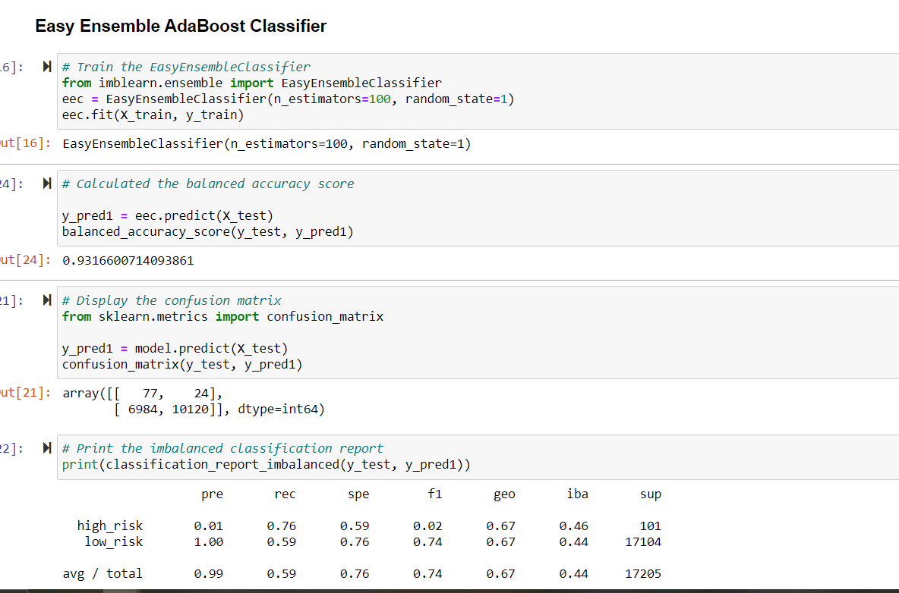

# Credit_Risk_Analysis-

# Overview of the analysis: 
Credit risk is an inherently unbalanced classification problem, as good loans easily outnumber risky loans. We employed different techniques to train and evaluate models with unbalanced classes. We built imbalanced-learn and scikit-learn libaries to evaluate models using resampling. Our goal is to determine which sampling is the best to predict credit risk.

# Results: 
As shown below our Random Sample has a Balanced Accuracy Score: 65.03%. with our Precision High Risk: 0.01 and  Low Risk: 1.00 with  Recall Score Difference: 0.08%..
Our Random Sampler represents our Lowest percentages.

In comparison to to the lowest the EasyEnemble Classifier had a Balanced Accuracy Score: 93.17% and Precision Score High Risk: at 0.09 the Precision Score Low Risk: at 1.00
and the Recall Score Difference: 0.02% . This represents the best credit risk and would be best suited to fit our needs. 

# Summary: 
Since companies profiabilities depends on accuracy in systems it would be best to use the sample with the better percentage on risk factors. Credit risk is crucial to whom service is provided to and can create downfalls if not accurate It is recommended that because the difference is only at a 0.2% this would be in the best interest of the company.

